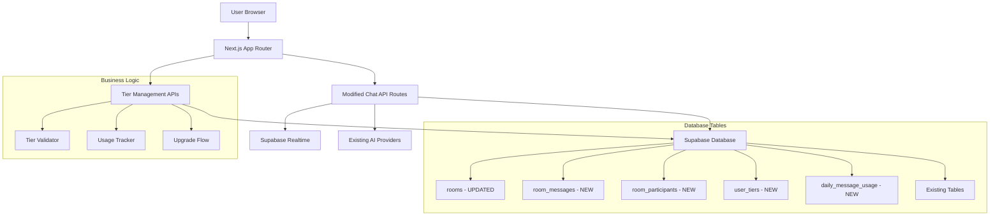

# Design Document

## Overview

The Group AI Chat feature extends the existing single-user chat system to support collaborative AI conversations with a simple freemium business model. The design leverages existing infrastructure (Supabase auth, database, chat components) while adding only 5 simple tables for group functionality and basic tier management. The system uses Supabase Realtime for real-time collaboration and implements message-based rate limiting for cost control.

## Architecture

### High-Level Architecture



### Component Architecture

The design reuses existing chat components with minimal modifications:

- **Existing Chat.tsx**: Add room context parameter
- **Existing MessageInput**: Add room broadcasting
- **New GroupChatPage**: Simple wrapper around existing Chat component
- **New ParticipantsList**: Shows active participants (simple list)
- **New JoinRoomForm**: Simple form for share code and display name

## Components and Interfaces

### Database Schema Extensions

#### New Tables (Simple Business Approach)

```sql
-- Rooms table with tier support
CREATE TABLE rooms (
  id uuid PRIMARY KEY DEFAULT uuid_generate_v4(),
  name text,
  created_by uuid REFERENCES users(id) NOT NULL,
  share_code text UNIQUE NOT NULL, -- e.g., "VACATION-2024"
  creator_tier varchar(10) DEFAULT 'free', -- 'free' or 'pro'
  max_participants integer DEFAULT 5, -- 5 for free, 20 for pro
  created_at timestamp with time zone DEFAULT CURRENT_TIMESTAMP,
  expires_at timestamp with time zone DEFAULT (CURRENT_TIMESTAMP + 
    CASE WHEN creator_tier = 'pro' THEN interval '30 days' 
    ELSE interval '7 days' END)
);

-- Room messages (reuse existing message structure)
CREATE TABLE room_messages (
  id uuid PRIMARY KEY DEFAULT uuid_generate_v4(),
  room_id uuid REFERENCES rooms(id) ON DELETE CASCADE,
  sender_name text NOT NULL, -- Display name for attribution
  content text,
  is_ai_response boolean DEFAULT false,
  sources jsonb,
  reasoning text,
  created_at timestamp with time zone DEFAULT CURRENT_TIMESTAMP
);

-- Participant tracking (session-based)
CREATE TABLE room_participants (
  room_id uuid REFERENCES rooms(id) ON DELETE CASCADE,
  session_id text NOT NULL, -- Browser session ID
  display_name text NOT NULL,
  joined_at timestamp with time zone DEFAULT CURRENT_TIMESTAMP,
  PRIMARY KEY (room_id, session_id)
);

-- Simple user tier management
CREATE TABLE user_tiers (
  user_id uuid REFERENCES users(id) PRIMARY KEY,
  tier varchar(10) DEFAULT 'free',
  upgraded_at timestamp with time zone
);

-- Simple daily usage tracking
CREATE TABLE daily_message_usage (
  user_id uuid REFERENCES users(id),
  room_id uuid REFERENCES rooms(id),
  date date DEFAULT CURRENT_DATE,
  message_count integer DEFAULT 0,
  PRIMARY KEY (user_id, room_id, date)
);
```

### API Routes

#### Modified Existing Routes

1. **POST /api/chat/route.ts** (Modified)
   - Add optional `roomId` parameter
   - Check daily message limits before processing
   - If roomId present, save to room_messages instead of chat_messages
   - Increment daily usage counter
   - Broadcast AI responses via Supabase Realtime
   - Reuse all existing AI integration logic

#### New Business API Endpoints

2. **POST /api/rooms/create**
   - Check user tier and room creation limits
   - Creates new room with tier-appropriate settings
   - Returns room details and shareable link

3. **POST /api/rooms/[shareCode]/join**
   - Validates share code and room capacity
   - Checks participant limits based on room tier
   - Creates/updates participant record
   - Returns room access and message history

4. **GET /api/rooms/[shareCode]/messages**
   - Fetches message history for room (last 30 messages)
   - Returns formatted messages for AI context

5. **GET /api/tiers/current**
   - Returns user's current tier information
   - Includes usage limits and current usage

6. **POST /api/tiers/upgrade**
   - Handles tier upgrade flow
   - Updates user_tiers table

7. **GET /api/usage/daily**
   - Returns daily message usage for user/room
   - Used for rate limiting checks

### Frontend Components

#### GroupChatPage Component (Simple)

```typescript
interface GroupChatPageProps {
  shareCode: string;
  initialMessages: RoomMessage[];
  participants: Participant[];
  userTier: 'free' | 'pro';
  dailyUsage: number;
  dailyLimit: number;
  roomMaxParticipants: number;
}

interface Participant {
  displayName: string;
  isOnline: boolean;
  lastSeen: Date;
}

interface RoomMessage {
  id: string;
  content: string;
  senderName: string; // "AI Assistant" or participant name
  isAiResponse: boolean;
  createdAt: Date;
  sources?: any[];
  reasoning?: string;
}
```

#### JoinRoomForm Component (Simple)

```typescript
interface JoinRoomFormProps {
  onJoin: (displayName: string) => void;
  onError: (error: string) => void;
  roomName?: string; // Pre-populated from URL
  currentParticipants: number;
  maxParticipants: number;
  roomTier: 'free' | 'pro';
}

// Shows participant count and tier limits
```

### Business Logic Components

#### Simple Tier Management

```typescript
// lib/business/SimpleTierManager.ts
export class SimpleTierManager {
  async getUserTier(userId: string): Promise<'free' | 'pro'> {
    // Simple database lookup from user_tiers table
  }
  
  async canCreateRoom(userId: string): Promise<boolean> {
    // Check if user can create more rooms (basic limits)
  }
  
  async canJoinRoom(roomId: string): Promise<boolean> {
    // Check participant limits (5 free, 20 pro)
  }
  
  getRoomLimits(tier: string): { maxParticipants: number; expirationDays: number } {
    return tier === 'pro' 
      ? { maxParticipants: 20, expirationDays: 30 }
      : { maxParticipants: 5, expirationDays: 7 };
  }
}
```

#### Simple Rate Limiting

```typescript
// lib/business/SimpleRateLimit.ts
export class SimpleRateLimit {
  async canSendMessage(userId: string, roomId: string): Promise<boolean> {
    // Check daily message count (30 free, 100 pro)
    const usage = await this.getDailyUsage(userId, roomId);
    const tier = await SimpleTierManager.getUserTier(userId);
    const limit = tier === 'pro' ? 100 : 30;
    return usage.message_count < limit;
  }
  
  async incrementUsage(userId: string, roomId: string): Promise<void> {
    // Increment daily counter in daily_message_usage table
  }
}
```

#### Simple Context Management

```typescript
// lib/business/SimpleContext.ts
export class SimpleContext {
  async formatMessagesForAI(roomId: string): Promise<Message[]> {
    // Get last 30 messages from room_messages
    // Format as "Alice: message content"
    // Return formatted array for AI context
  }
}
```

### Real-time Integration

#### Supabase Realtime Channels (Simple)

1. **Single Room Channel**: `room:{shareCode}`
   - New message broadcasts
   - Participant join/leave events
   - Usage limit notifications

#### Real-time Event Types (Minimal)

```typescript
type RealtimeEvent = 
  | { type: 'new_message'; message: RoomMessage }
  | { type: 'participant_joined'; displayName: string }
  | { type: 'participant_left'; displayName: string }
  | { type: 'ai_thinking'; isThinking: boolean }
  | { type: 'usage_warning'; remaining: number };
```

## Data Models

### Core Data Flow (Simplified)

1. **Room Creation**:
   - User creates room → Check tier limits → Generate share code (e.g., "VACATION-2024") → Store in database with tier settings → Return shareable link

2. **Room Joining**:
   - User clicks shareable link → Enters display name → Validate room and participant limits → Create participant session → Join realtime channel

3. **Message Flow**:
   - User sends message → Check daily usage limits → Store in room_messages → Increment usage counter → Broadcast via realtime → AI processes (reuse existing logic) → Store AI response → Broadcast AI response

4. **Participant Management**:
   - Simple session-based tracking
   - Update last_seen on activity
   - Clean up inactive sessions periodically

5. **Usage Tracking**:
   - Track daily message counts per user per room
   - Show usage warnings at 80% of daily limit
   - Block messages when daily limit reached
   - Reset counters at midnight UTC

### Share Code System

- Human-readable codes like "VACATION-2024", "STUDY-GROUP", "PROJECT-X"
- Generated from word combinations or user-provided names
- No complex security needed - rooms expire in 30 days
- Easy to share verbally or via text

## Error Handling

### Client-Side Error Handling (Simple)

1. **Join Errors**:
   - Invalid room link feedback
   - Expired room notifications
   - Display name validation

2. **Message Errors**:
   - Reuse existing chat error handling
   - Simple retry for failed sends
   - Connection status indicator

### Server-Side Error Handling (Reuse Existing)

1. **Database Errors**:
   - Basic error logging
   - Graceful fallbacks

2. **AI Integration Errors**:
   - Reuse all existing error handling from chat system
   - Same rate limiting and timeout logic

## Testing Strategy

### Manual Testing (MVP Approach)

1. **Core Flows**:
   - Room creation and share code generation
   - Joining with share code and display name
   - Multi-participant messaging
   - AI responses in group context

2. **Basic Error Cases**:
   - Invalid room links
   - Expired rooms
   - Network disconnections

### Automated Testing (Minimal)

1. **API Route Tests**:
   - Room creation endpoint
   - Join validation
   - Message storage (reuse existing patterns)

2. **Component Tests**:
   - JoinRoomForm validation
   - Basic rendering tests

## Security Considerations

### Simple Security Model

- Room creators must be authenticated users
- Anonymous participants allowed (session-based tracking)
- Share codes provide basic access control
- Automatic 30-day expiration limits exposure

### Rate Limiting

- Reuse existing AI rate limiting
- Basic room creation limits (5 rooms per user)
- Simple message frequency limits

## Performance Considerations

### MVP Constraints

- Room participant limit: 5 users (free), 20 users (pro)
- Message history: last 30 messages for AI context
- Simple database queries (optimize later)
- Basic realtime channel per room

### Simple Optimizations

- Index on share_code for fast lookups
- Automatic cleanup of expired rooms
- Basic message pagination
- Simple daily usage counters